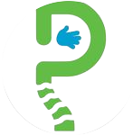
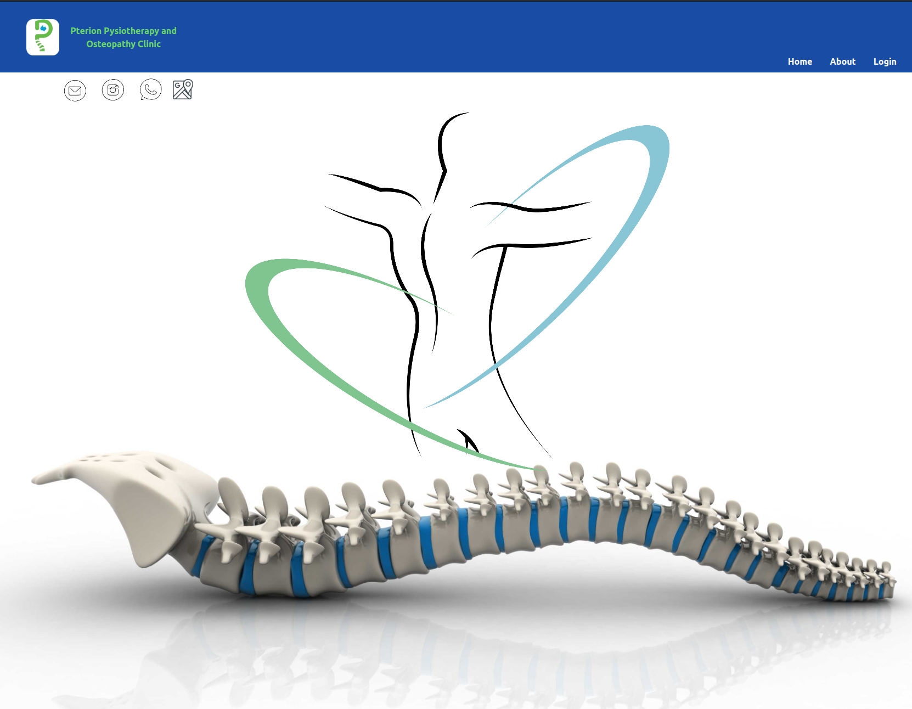
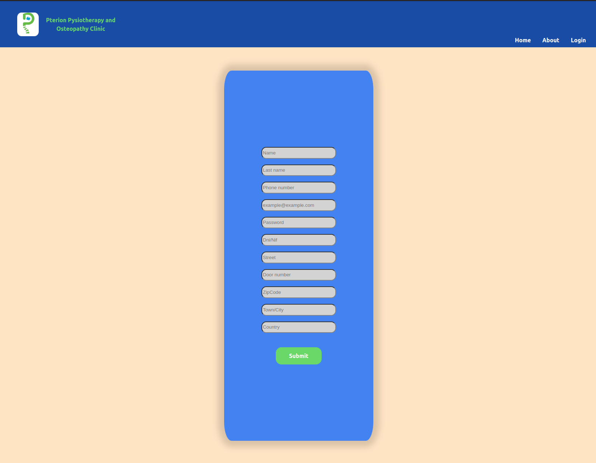
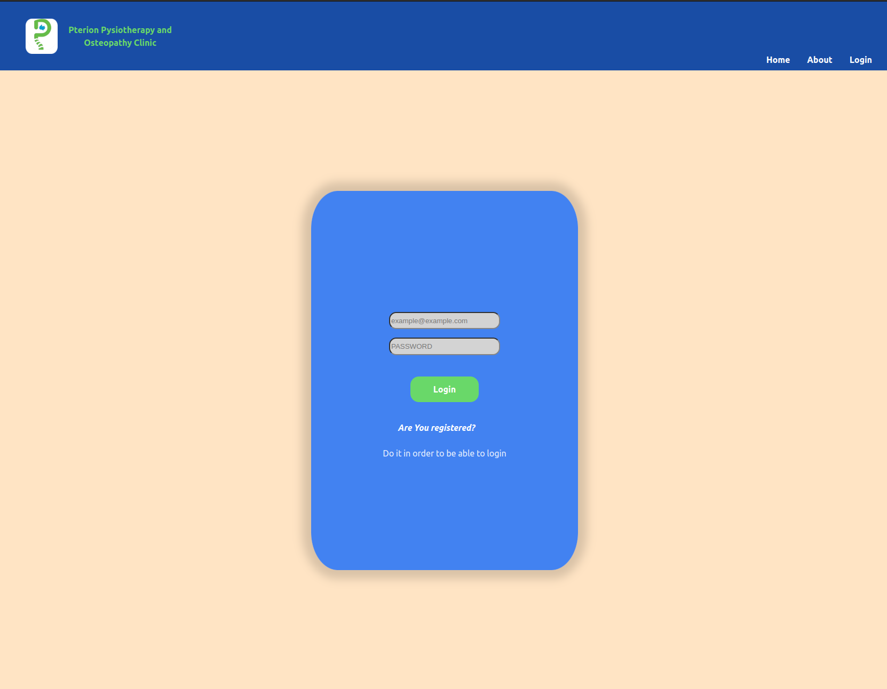
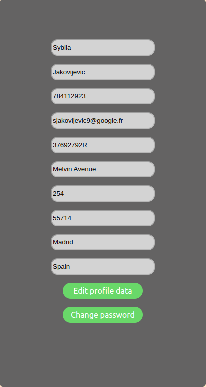
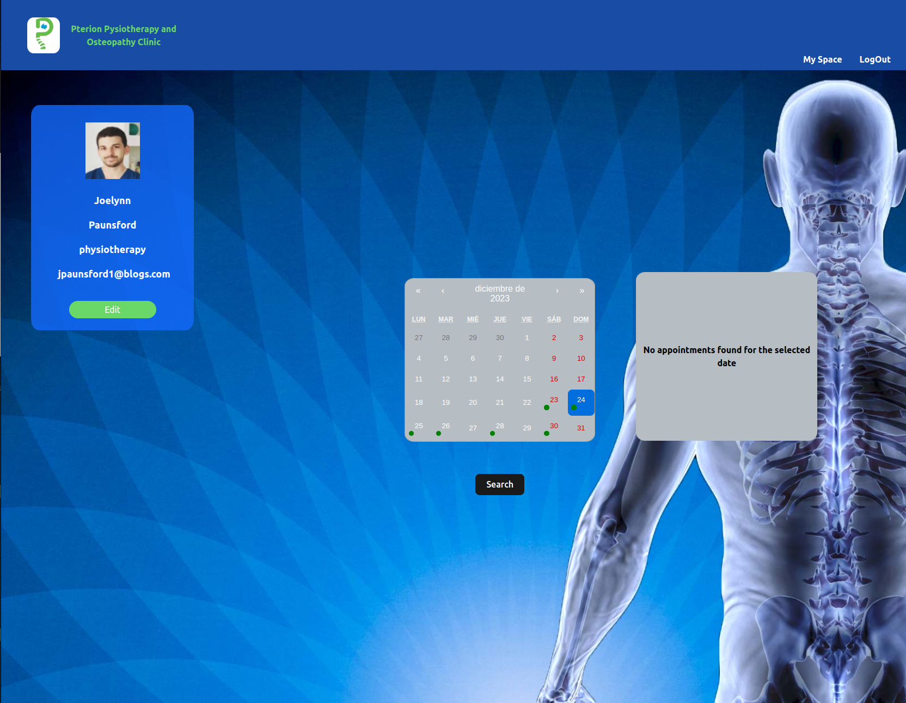
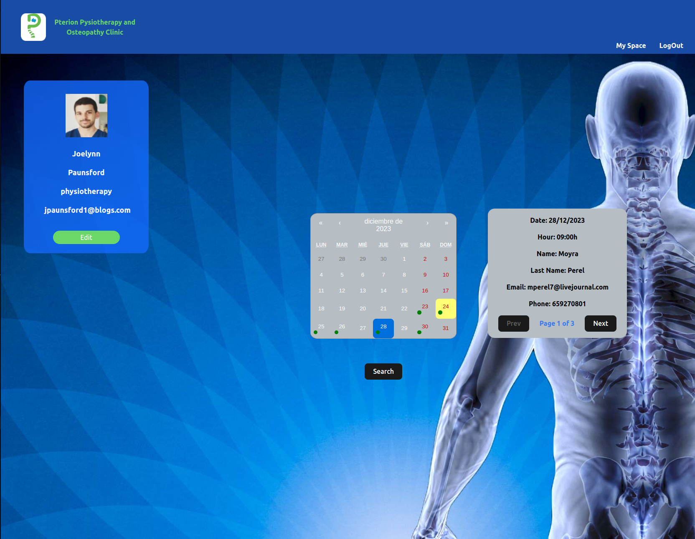
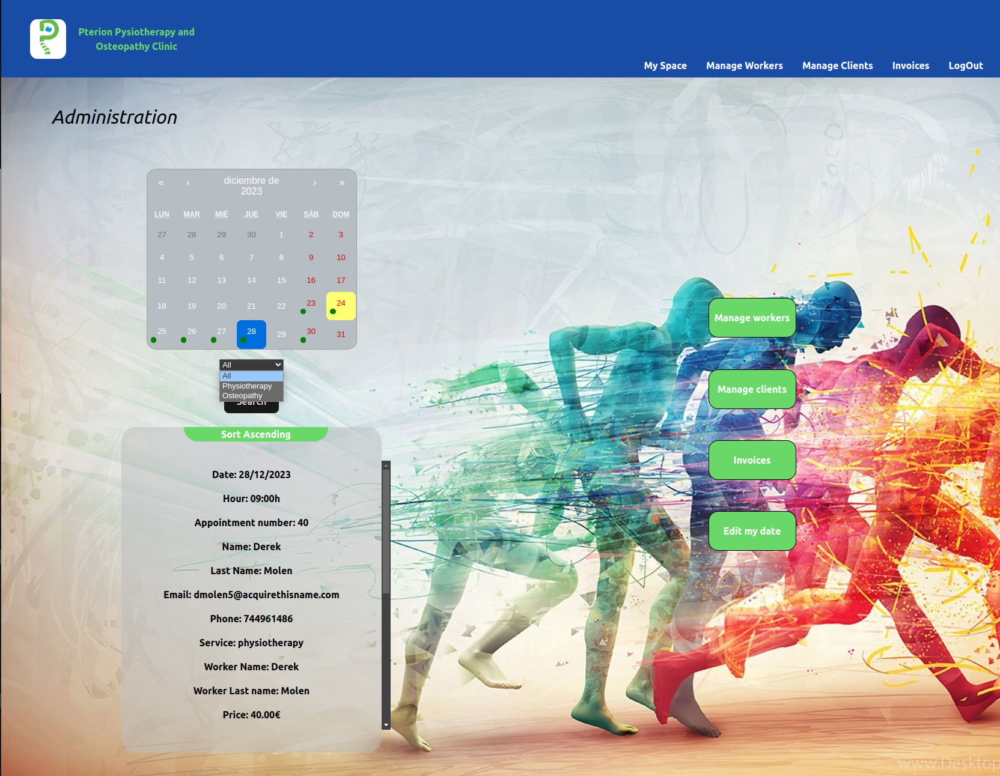
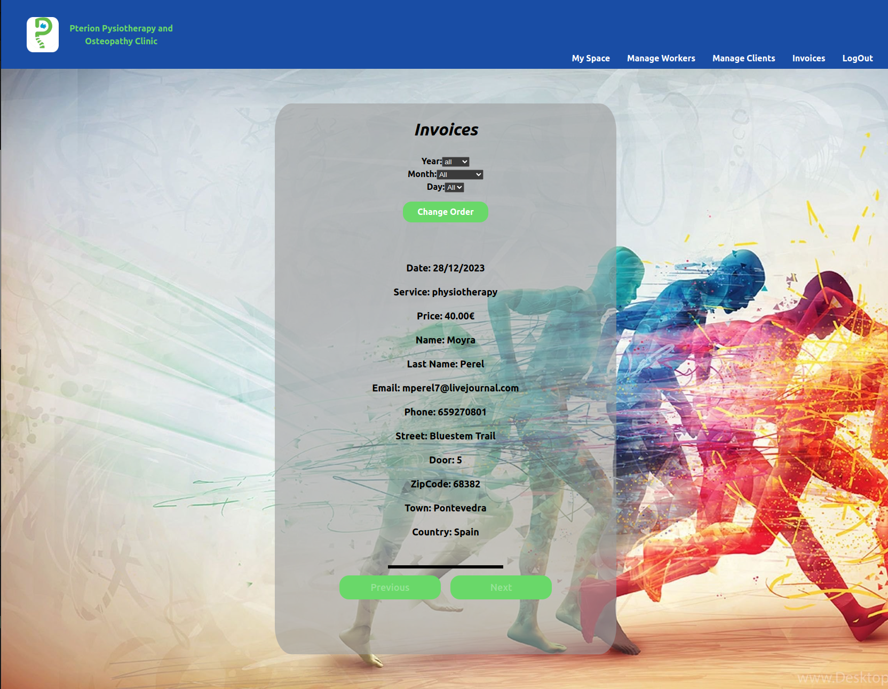

# Frontend app  

<div>
    <p align="center">
  
</p>
<p align="center">Pterion physioterapy and osteopathy Clinic</p>
<div>
<br></br>
<div>
<a href = "antonioinsa@tutanota.com"></a>
<a href="https://www.linkedin.com/in/antonioinsa/" target="_blank"></a> 
</p>
</div>
<br></br>
<details>
  <summary>Contenido 📝</summary>
  <ol>
    <li><a href="#objetivo-🎯">Objetivo</a></li>
    <li><a href="#sobre-el-proyecto-🔎">Sobre el proyecto</a></li>
    <li><a href="#stack">Stack</a></li>
    <li><a href="#instalación-en-local">Instalación</a></li>
    <li><a href="#animaciones">Animaciones</a></li>
    <li><a href="#vistas">Vistas</a></li>
    <li><a href="#futuras-funcionalidadesmejoras">Futuras funcionalidades\mejoras</a></li>
    <li><a href="#licencia">Licencia</a></li>
  </ol>
</details>

## Objetivo 🎯
Crear una web funcional sobre una clínica de fisioterapia y osteopatía para la gestión de citas y facturas de los clientes registrados.

## Sobre el proyecto 🔎
En este proyecto, como clientes, podemos gestionar nuestras citas (crear, actualizar fecha y cancelar). Cada usuario dispondrá de una cuenta o perfil en el que pueda actualizar sus datos (menos nombre, apellidos y DNI; exclusivo únicamente para el administrador) introducidos en el registro inicial. Por otro lado, tanto el trabajador como el administrador, disponen de perfiles únicamente para fines profesionales (visualización de citas, facturas, gestión de clientes y gestión de trabajadores).


## Stack
<div align="center">
<a href="https://www.reactjs.com/">
    
</a>
<a href="https://developer.mozilla.org/es/docs/Web/JavaScript">
    
</a>
 </div>

## Instalación en local
1. Clonar el repositorio
2. ` $ npm install `
3. ``` $ npm run dev ```

## Animaciones
<div>
  Próximamente
</div>


## Vistas
<br></br>

<div>
<p align="center">
 
</div> 

<div>
<p align="center">

</div>

<div>
<p align="center">


</div>

<div>
<p align="center">


</div>


<div>
<p align="center">


</div>


<div>
<p align="center">


</div>
<br>


## Futuras funcionalidades\mejoras
✅ Facturación de cada cita para el cliente, así como facturación mensual y anual para la clínica.

✅ Añadir ejercicios a las citas, proporcionando videos explicativos para que el cliente pueda consultarlos y realizar estiramientos en casa.

✅ Envío de correo electrónico de recordatorio para la cita.

✅ E-commerce donde los usuarios pueden comprar cremas antiinflamatorias, accesorios para ejercicios (gomas elásticas, cintas TRX, aros, pelotas rítmicas, etc.), ropa deportiva, tarjetas regalo, y más.

✅ Integración visual a través de modales.


## Licencia
Proyecto desarrollado por Antonio Insa Benavent, bajo licencia MIT.

Consulta el archivo <a href="./LICENSE">`LICENSE`</a> para más información.